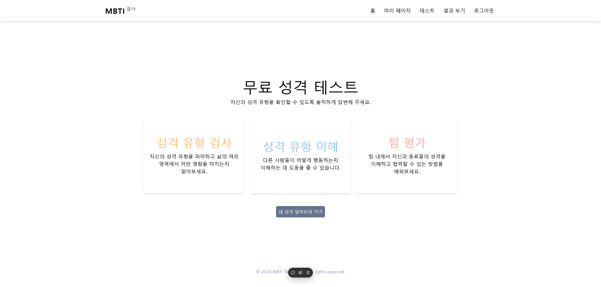
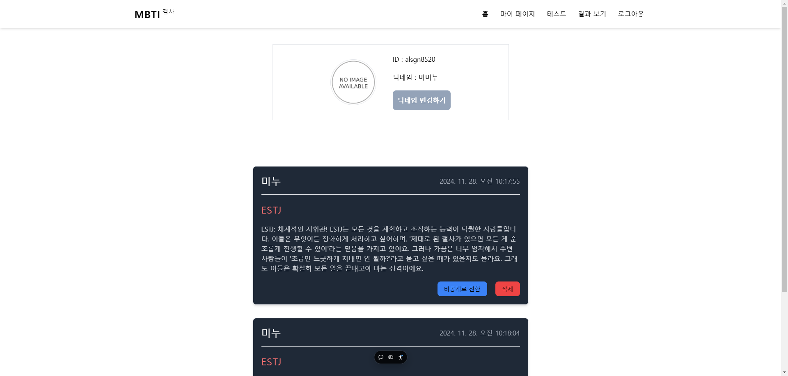
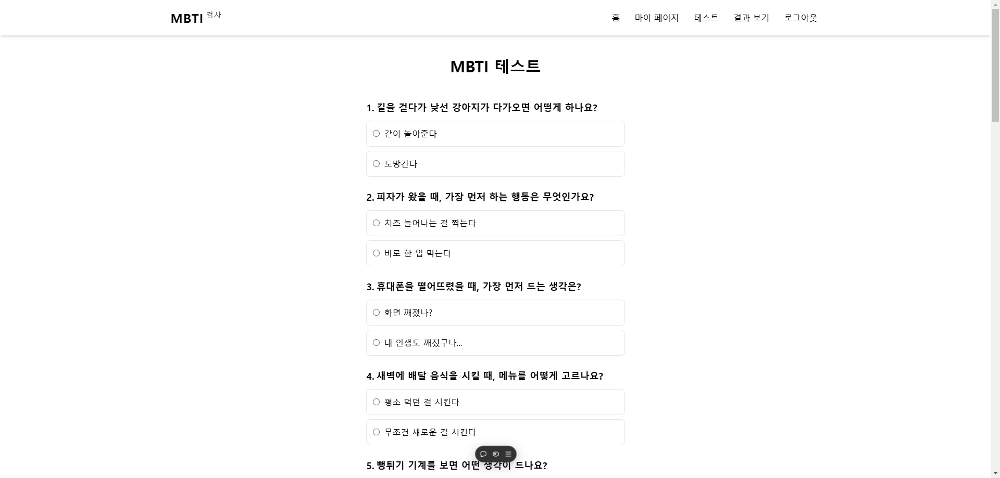
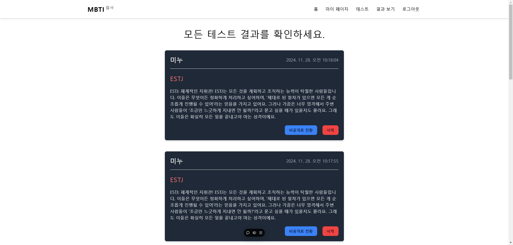
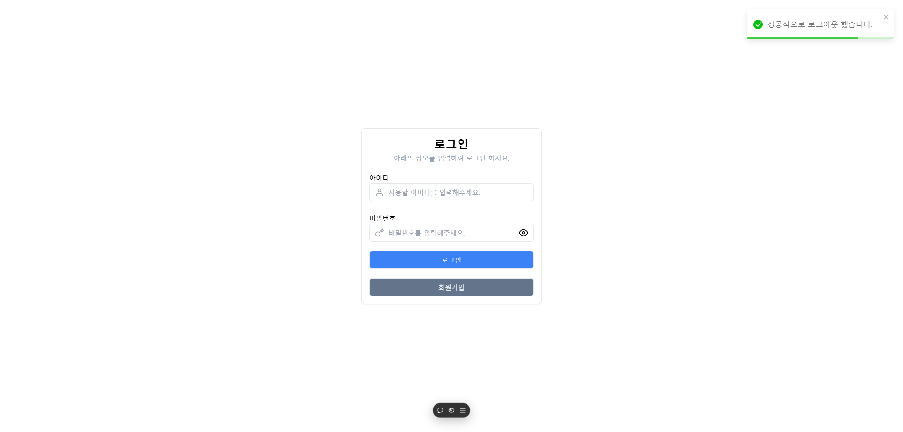
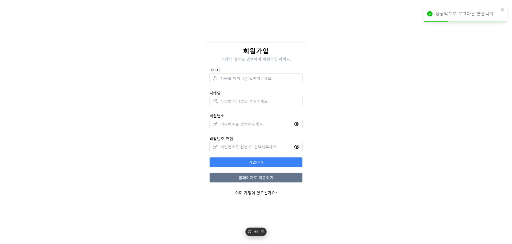

# MBTI 검사 프로젝트

## 📑 프로젝트 개요

**MBTI 검사 프로젝트**는 사용자 인증 시스템과 심층적인 MBTI 성격 유형 검사를 통합하여, 개인의 성격을 탐색하고 결과를 공유할 수 있는 플랫폼을 제공합니다.

## 📌 기능

1. **사용자 인증 및 관리**

   - 회원가입 및 로그인 시스템
   - JWT기반 보안 인증
   - 사용자 프로필 관리
     - 닉네임 수정
     - 로그인 상태 지속성 관리

2. **MBTI 검사 결과 관리**
   - 검사 결과 저장 및 관리
   - 검사 결과 공개/비공개 전환 기능
   - 개인 결과 히스토리 보기
   - 검사 결과 삭제 기능

## 🛠️ 기술 스택

- React
- React Router Dom
- axios
- tailwind css
- zustand
- tanstack query
- react-toastify

## 📁 폴더 구조

```
📦 REACT-MBTI-PROJECT
├── 📂 .vscode/
├── 📂 node_modules/
├── 📂 public/
│   ├── 📂 images/
│   └── vite.svg
├── 📂 src/
│   ├── 📂 api
│   ├── 📂 assets/
│   │   └── react.svg
│   ├── 📂 components/
│   │   ├── 📂 feature
│   │   ├── 📂 icon
│   │   ├── 📂 layout
│   │   ├── 📂 router
│   │   ├── 📂 ui
│   │   │   ├── home/
│   │   │   ├── main/
│   │   │   ├── profile/
│   │   │   ├── result/
│   │   │   └── test/
│   ├── 📂 data
│   ├── 📂 pages/
│   │   ├── home/
│   │   ├── login/
│   │   ├── main/
│   │   ├── profile/
│   │   ├── result/
│   │   ├── signup/
│   │   └── test/
│   ├── 📂 store
└── └── 📂 utils

```

## 🧩 설치 및 실행 방법

1. **프로젝트 클론**

   ```bash
   git clone https://github.com/Kminhoo/react-mbti-project.git
   cd react-mbti-project
   ```

2. **종속성 설치**

   ```bash
   npm install
   ```

3. **개발 서버 실행**

   ```bash
   npm run dev
   ```

## 📱 화면 구성

|          메인 페이지           |          프로필 페이지           |          테스트 페이지           |
| :----------------------------: | :------------------------------: | :------------------------------: |
|  |  |  |

|           결과 페이지            |         로그인 페이지          |          회원가입 페이지           |
| :------------------------------: | :----------------------------: | :--------------------------------: |
|  |  |  |

## 👨‍💻 구현 내용

- zustand : 사용자 정보 전역 상태 관리

- Tanstack Query

  - 서버 상태 관리
  - 데이터 페칭
  - 낙관적 업데이트

- Axios Instance : 일관된 API 요청 관리

- Axios Interceptor
  - 요청/응답 전처리
  - 토큰 만료 후 처리

## 📝 프로젝트 회고

### 어려웠던 점

- Tanstack Query useMutation을 사용한 API 요청 관리
- Axios interceptor를 사용한 토근 만료 처리

### 배운 점

- Tanstack Query를 통한 서버 상태 관리
- Axios Instance, Interceptor를 통한 일관된 API 처리 및 전.후 처리

## 🔗 배포 링크

- [MBTI 검사](https://react-mbti-project.vercel.app//)
- [GitHub Repository](https://github.com/Kminhoo/react-mbti-project)
